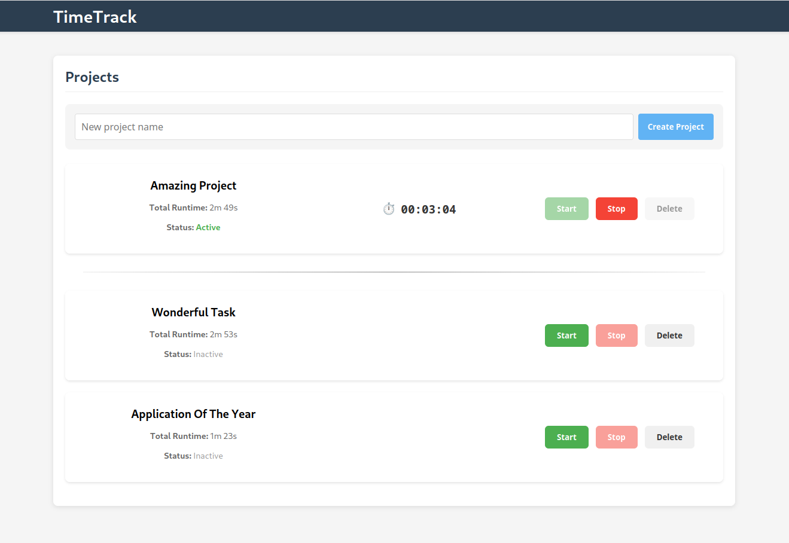

# TimeTrack

A modern, intuitive time tracking application designed to help you manage your projects and track your productivity with ease.



## Features

- **Project Management**: Create, edit, and delete projects
- **Time Tracking**: Start and stop timers for accurate time tracking
- **Visual Distinction**: Clear separation between active and inactive projects
- **Smooth Animations**: Modern UI with smooth transitions and animations
- **Responsive Design**: Works on desktop and mobile devices

## Tech Stack

### Frontend
- React.js with TypeScript
- CSS with modern animations and transitions
- Responsive design

### Backend
- RESTful API architecture
- Database storage for projects and time entries

## Installation

### Prerequisites
- Node.js (v23 or later)
- npm or yarn

### Setup Steps

1. Clone the repository:
```bash
git clone https://github.com/yourusername/TimeTrack.git
cd TimeTrack
```

2. Install dependencies:
```bash
cd frontend
yarn install
```

3. Start the development servers:

Frontend:
```bash
yarn start
```

Backend:
```bash
# Navigate to the root directory
cd ..
```

To build and run the backend using Docker:

```bash
# Build and start all services
docker-compose up -d

# View logs
docker-compose logs -f

# Rebuild containers if you make changes
docker-compose up -d --build
```

For debugging:

```bash
# Start the services in debug mode
docker-compose -f docker-compose.yml -f docker-compose.debug.yml up -d

# Stop all services
docker-compose down
```

## Usage

### Project Management

1. **Creating a Project**: Use the "Create Project" form to add a new project
2. **Starting Time Tracking**: Click the "Start" button on a project to begin tracking time
3. **Stopping Time Tracking**: Click the "Stop" button on an active project to stop tracking
4. **Editing a Project**: Click the edit icon to modify project details
5. **Deleting a Project**: Click the delete icon to remove a project

### Understanding the Interface

- **Active Projects**: Show at the top of the list with a visual separator
- **Inactive Projects**: Listed below the separator
- **Visual Feedback**: Animations provide context for state changes

## Project Structure

```
TimeTrack/
├── frontend/              # React frontend
│   ├── public/            # Static files
│   └── src/               # Source files
│       ├── components/    # React components
│       ├── services/      # API services
│       ├── types/         # TypeScript types
│       └── utils/         # Utility functions
└── README.md              # This file
```

## Key Components

- **ProjectList**: Manages the list of projects with animations and state
- **ProjectItem**: Individual project display with controls
- **CreateProjectForm**: Form for creating new projects

## Contributing

Contributions are welcome! Please feel free to submit a Pull Request.

1. Fork the repository
2. Create your feature branch (`git checkout -b feature/amazing-feature`)
3. Commit your changes (`git commit -m 'Add some amazing feature'`)
4. Push to the branch (`git push origin feature/amazing-feature`)
5. Open a Pull Request

## License

This project is licensed under the MIT License - see the LICENSE file for details.

## Acknowledgments

- Thanks to all contributors who have helped shape this project
- Inspired by productivity and time management best practices 