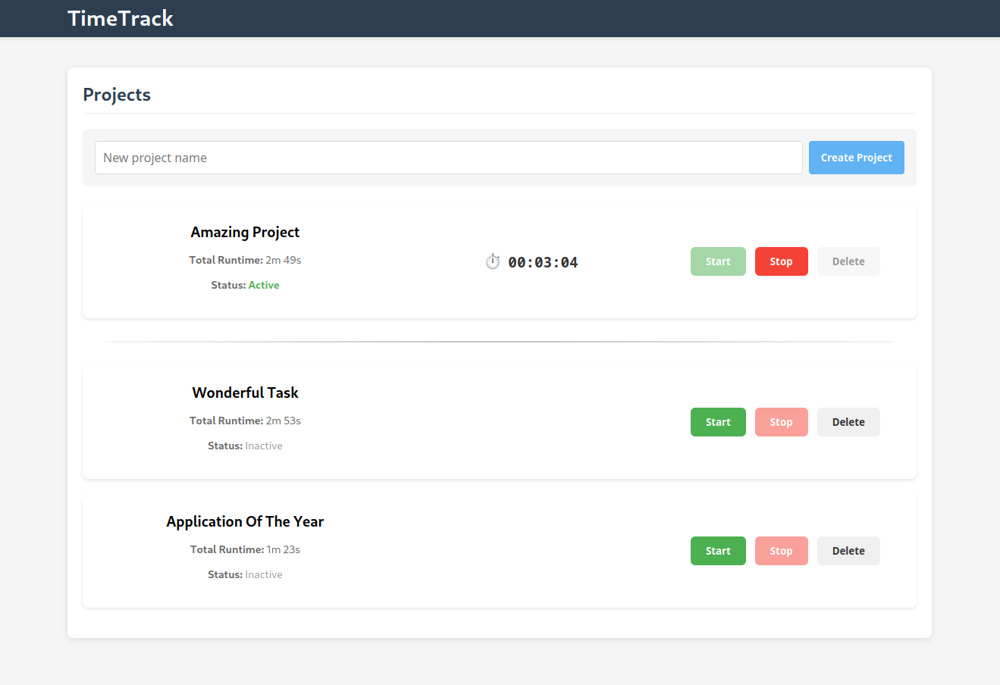

# TimeTrack

A modern, intuitive time tracking application designed to help you manage your projects and track your productivity with ease.



## Features

- **Project Management**: Create, edit, and delete projects
- **Time Tracking**: Start and stop timers for accurate time tracking

## Tech Stack

### Frontend
- React.js with TypeScript
- Vite (build tool)
- React Router
- Axios for API requests

### Backend
- RESTful API architecture in GO
- Postgres as database storage

## Installation

### Prerequisites
- Node.js (v23 or later)
- npm or yarn

### Setup Steps

1. Clone the repository:
```bash
git clone https://github.com/yourusername/TimeTrack.git
cd TimeTrack
```

2. Install dependencies:
```bash
cd frontend
yarn install
```

3. Start the development servers:

Frontend:
```bash
yarn start
```

Backend:
```bash
cd backend
```

To build and run the backend using Docker:

```bash
# Build service
docker buildx build --target builder .

# Run service in debug mode
docker compose --profile debug up --build

## Usage

### Project Management

1. **Creating a Project**: Use the "Create Project" form to add a new project
2. **Starting Time Tracking**: Click the "Start" button on a project to begin tracking time
3. **Stopping Time Tracking**: Click the "Stop" button on an active project to stop tracking
4. **Editing a Project**: Click the edit icon to modify project details
5. **Deleting a Project**: Click the delete icon to remove a project

## Project Structure

```
TimeTrack/
├── frontend/                   
│   ├── public/                 # Static files
│   └── src/                    
│       ├── components/         # React components
│       ├── services/           # API services
│       ├── types/              # TypeScript types
│       └── utils/              # Utility functions
│
└── backend/                    
    ├── database/               # Database migrations and schemas
    ├── pkg/                    
    │   ├── projects/           # Project management functionality
    │   │   ├── api.go          # http request handling
    │   │   ├── di.go           # dependency injection of layers
    │   │   ├── entities.go     # entities used in domain
    │   │   ├── handler.go      # business logic between api and repository
    │   │   └── repository.go   # storing and reading from database
    │   │
    │   ├── libraries/          # Shared libraries and utilities
    │   └── main.go             # Application entry point
    │
    ├── compose.yaml            # Docker Compose configuration
    └── Dockerfile              # Docker build instructions
```

## Contributing

Contributions are welcome! Please feel free to submit a Pull Request.

1. Fork the repository
2. Create your feature branch (`git checkout -b feature/amazing-feature`)
3. Commit your changes (`git commit -m 'Add some amazing feature'`)
4. Push to the branch (`git push origin feature/amazing-feature`)
5. Open a Pull Request

## License

This project is licensed under the GPL-3 License - see the LICENSE file for details.
